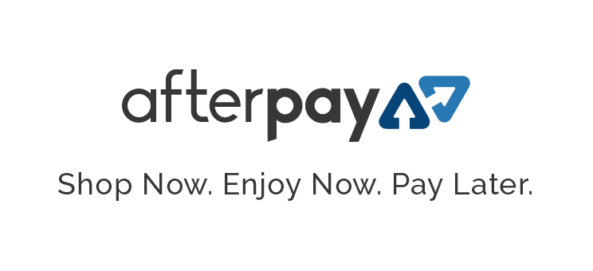
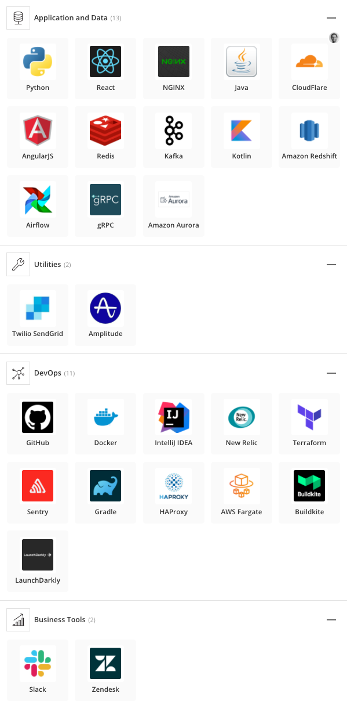
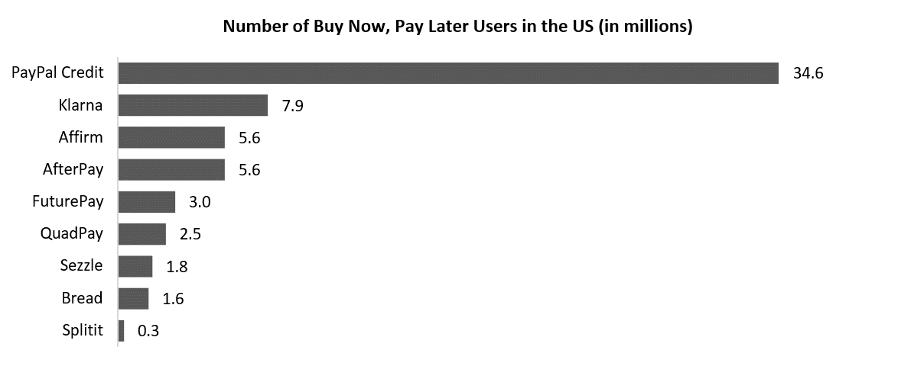

# Afterpay 

## Overview and Origin

* Company: Afterpay (APT)

* Company was incorporated in October 2014

* Nick Molnar and Anthony Eisen are the founders

* The idea of Afterpay came about when Molnar a private equity analyst (aged 25) when to his neighbour Eisen (aged 48), a seasoned Investment Banker, with an idea of a company that " took all the risk out of retail, for the retailer and the consumer"

* The company was initially bootstrapped with capital from friends and family of Molnar Eisen but then was financed with private funding rounds utilising Eisen's connections. The company went public in 2020 growing from an intial $28 million valuation to $35 billion. Afterpay was eventually acquired by payments company Sqaure for $39 billion AUD

## Business Activities:

* What specific financial problem is the company or project trying to solve?

Afterpay easy short term credit marketed towards millenials who are reluctant to use credit cards because of their general lack ot transparency and the negative stigma associated with them. Afterpay users get a pre-aproved limit , with loans paid off in 4 installments due every 2 weeks.

* Who is the company's intended customer?  Is there any information about the market size of this set of customers?

Millenials and low-income earners how need to a fast,quick,easy and transparent source of short term capital.

* What solution does this company offer that their competitors do not or cannot offer? (What is the unfair advantage they utilize?)

The competitive advantage is its straightforward interest collection method aswell as the network effects and brand credibility it estabilished by being one of the first major buy now pay later applications to market. 

* Which technologies are they currently using, and how are they implementing them? (This may take a little bit of sleuthing–– you may want to search the company’s engineering blog or use sites like Stackshare to find this information.)

Below is the technology stack as advised by Craig Baker Afterpay's Chief Architect

## Landscape:

* What domain of the financial industry is the company in?

The Digital Payments industry specialising in retail. This is colloquially called the "Buy Now Pay Later" sector.

* What have been the major trends and innovations of this domain over the last 5-10 years?

Customers are slowly moving away from traditional sources of credit such as credit cards due to their complex nature. The industry is transitioning towards digital payments even for large banks with credit cards slowly becoming obeselete as customers pay with their phones.

* What are the other major companies in this domain?

Zip,Sezzle,Paypal Credit,Fingerhut

## Results

* What has been the business impact of this company so far?

It is has allowed retail businesses to increase their sales by making it easier for customers to access credit. Furthermore, customers are able to access a more transparent and user-friendly form of credit allowing them to make more purchases.

* What are some of the core metrics that companies in this domain use to measure success? How is your company performing, based on these metrics?

Afterpay measures its performance primarily through its "Afterpay Net Margin" which is the Net Transaction Margin (Merchant margin earned directly from underlying sales), plus other income and margin items. In the 2021 Financial year Afterpay's net margin was up 74% to $434 million.

* How is your company performing relative to competitors in the same domain?

## Recommendations

* If you were to advise the company, what products or services would you suggest they offer? (This could be something that a competitor offers, or use your imagination!)

 I would primarily reccomend the company adopting Cryptopay (allow users to use crypto converted to fiat purchases for retail) as they already have an existing payment network and brand credibility.

The company could as implement their own token and allow retailers to utilise their computers to facilitaten the payment network

* Why do you think that offering this product or service would benefit the company?

They expand their user base and increase the lifetime Customer Value leading to increased revenue. Additionally Cryptopay will allow them to increase their cultural as crypto start to dominate popular culture.

* What technologies would this additional product or service utilize?

Primarily Blockchain technology aswell as pre-existing payment networks such as Visa or Mastercard.

* Why are these technologies appropriate for your solution?

The technology is appropriate as the payment network is already created and they can use blockchain to decentralise it to make it more future-proof due to changing consumer attitudes.